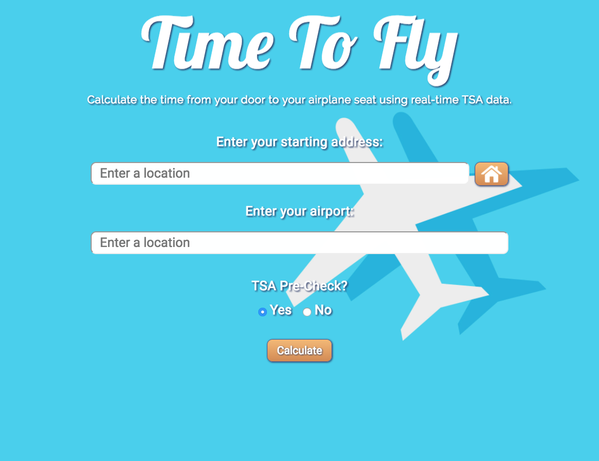
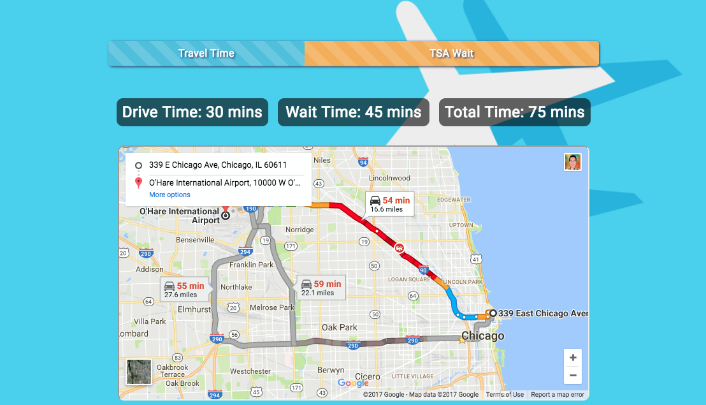

# Time-To-Fly App
* Calculate your time from home to your airplane seat, using the Google Maps API and the TSA Checkpoint Time API.
* Instructions:
	* Enter starting address (Home button saves last starting address).
	* Enter airport.
	* Select yes/no for TSA Pre-Check.
	* Click "Calculate" to view estimated total drive time and TSA wait time!
	* Note: TSA wait times are crowdsourced.

## Contributors/Roles

### Front-End
* Casey Aitken
* Ammad Shaikh

### Back-End
* Max Teibel
* Stephanie Stella

